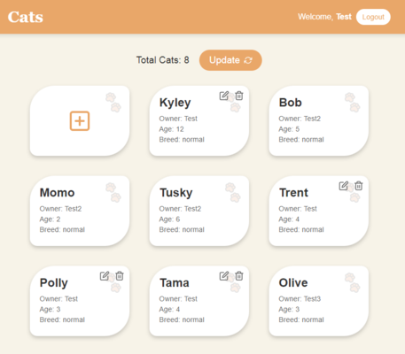

# Cats Project 🐾

<details>
  <summary>Screenshot</summary>
  <div align="center">

  

  </div>
</details>

## Description

Small fullstack project to try out some NestJS concepts, examples from the docs, design patters and best practices as well as serving client side static content (for SPA).
Technically, the project was not made from scratch, this is an extension of the project from the official NestJS docs with some additional features that were not originally present in the docs.

For the server side, the project uses [NestJS](https://nestjs.com/) + [MongoDB](https://www.mongodb.com/) as the database and [React](https://reactjs.org/) + [TypeScript](https://www.typescriptlang.org/) for the client side.

Key features:

- **CRUD** operations for Cats. Only authenticated users can create cats and only the owner can delete or update them.
- JWT based **Authentication** (for demo reasons the token is valid for 60 seconds).
- Implements **Repository Pattern** to work with the database models.

The project's [Hoppscotch](https://hoppscotch.io/) specification file is located in the `hoppscotch` directory.

**NOTE**: Usually you'd serve the client side using a static file server like [Nginx](https://www.nginx.com/) or [Apache](https://httpd.apache.org/) but for the sake of simplicity, the project serves the client side from NestJS application. But during development, the client side will be served from [Vite](https://vitejs.dev/)'s dev server.

## Project setup

Install both server and client dependencies

```bash
$ pnpm -r i
```

Copy and fill the `.env` file with the required environment variables, most importantly the `MONGODB_URL` variable:

```bash
$ cp .env.example .env
$ nano .env
```

Since the project uses [MongoDB](https://www.mongodb.com/) as the database, you'll need to install the [MongoDB Community Server](https://www.mongodb.com/try/download/community) and start it.
Alternatively, you can use Docker to run the MongoDB container:

```bash
# start the container
$ docker run -d -p 27017:27017 mongo
```

After that you need to provide the MongoDB connection string in the `.env` file.

## Scripts

### Development

To work on both server and client sides at the same time run both separately in watch mode:

#### Server (NestJS):

```bash
# server watch mode
$ pnpm run start:dev
```

#### Client (React + TypeScript):

```bash
# client watch mode
$ pnpm --prefix client dev
```

### Build

Sequence of commands to build and run the project for production:

```bash
# build the server
$ pnpm build
# build (copies dist to the server's dist/client folder)
$ pnpm --prefix client build
# run the server
$ pnpm run start:prod

```

### Tests

#### Server (NestJS):

```bash
# unit tests
$ pnpm run test

# e2e tests
$ pnpm run test:e2e

# test coverage
$ pnpm run test:cov
```
